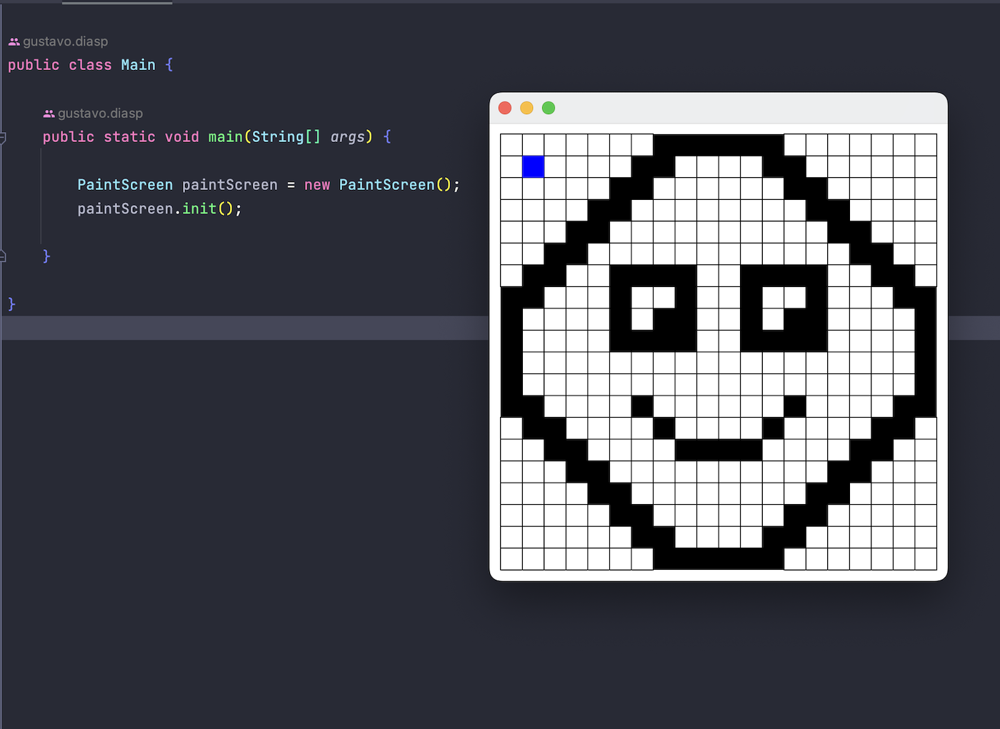
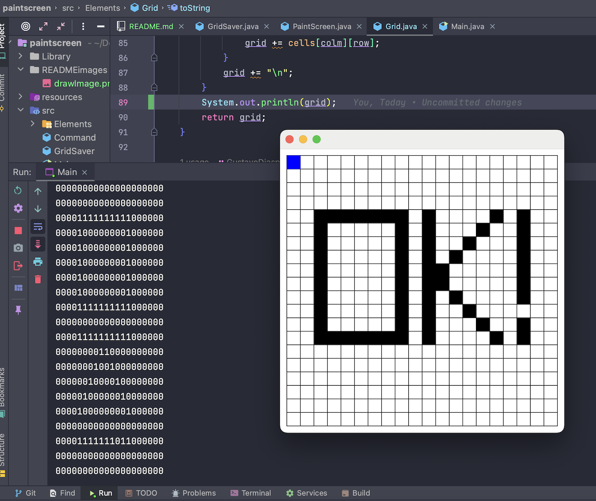

# Paint Screen

Paint Screen is a challenge by [Academia de Código](https://www.academiadecodigo.org/>) bootcamp.  
The objective was to create a Simple Graphics Library canvas able to save its drawings using Java I/O streams.

## Technologies
- Java;
- Simple Graphics Library;

## Commands
- Arrows to move the cursor;
- Spacebar to paint or erase cell;
- S to save drawing;
- L to load saved drawing;
- C to clear the whole grid;

----
## Draw anything you want

## Save
